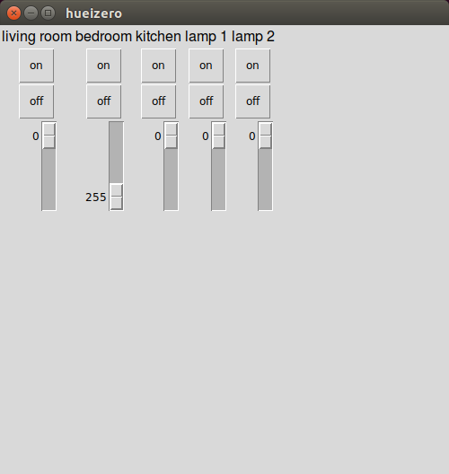

# hueizero (Philips Hue + guizero)

A demo app for controlling Philips Hue lights using a GUI created with [guizero](https://lawsie.github.io/guizero/).

## Software

Install with:

```bash
sudo pip3 install phue guizero
```


